## Escuela Colombiana de Ingeniería
### Arquitecturas de Software – ARSW


#### Ejercicio – programación concurrente, condiciones de carrera y sincronización de hilos. EJERCICIO INDIVIDUAL O EN PAREJAS.

##### Parte I – Antes de terminar la clase.

__Control de hilos con wait/notify. Productor/consumidor.__
__Santiago Arévalo Rojas__
__Juan Felipe Sánchez Pérez__

1. __Revise el funcionamiento del programa y ejecútelo. Mientras esto ocurren, ejecute jVisualVM y revise el consumo de CPU del proceso correspondiente. A qué se debe este consumo?, cual es la clase responsable?__  
	
	Luego de revisar el consumo de CPU por medio de jVisualVM, se evidencia que hay un consumo creciente porque la aplicación realiza demasiadas tareas, cargando a la CPU, por otra parte, la clase principal que se encarga de este consumo masivo es Producer porque es la que está añadiendo de manera ilimitada elementos a la cola ya que se encuentra en un bucle infinito, mientras que el consumidor, a pesar de que aporta un gasto porque también está en un while infinito, este consulta si la cola tiene elementos para imprimir.
2. __Haga los ajustes necesarios para que la solución use más eficientemente la CPU, teniendo en cuenta que -por ahora- la producción es lenta y el consumo es rápido. Verifique con JVisualVM que el consumo de CPU se reduzca.__  
	Con el fin de de disminuir el consumo de CPU, si la cola se encuentra vacía, podemos indicarle al consumidor que espere hasta que la cola tenga algún elemento para ser consumido, haciendole wait(). Una vez el productor haya añadido algún elemento a la cola, se hace un notify() para indicarle al consumidor que ya puede consumir:
	
	Analizando el consumo confirmamos una dismunución notable en el consumo de CPU.
3. __Haga que ahora el productor produzca muy rápido, y el consumidor consuma lento. Teniendo en cuenta que el productor conoce un límite de Stock (cuantos elementos debería tener, a lo sumo en la cola), haga que dicho límite se respete. Revise el API de la colección usada como cola para ver cómo garantizar que dicho límite no se supere. Verifique que, al poner un límite pequeño para el 'stock', no haya consumo alto de CPU ni errores.__  
	Para garantizar los tiempos de consumo y producción lo realizamos a través del método sleep de la clase Thread, haciendo que se consuma cada 3 segundos y se produzca cada segundo un nuevo elemento.
	Por otra parte, para garantizar el límite de producción hicimos uso del constructor que proporciona la API en el cual se define la máxima capacidad de la cola.
	Volviendo a verificar el consumo de CPU, se mantiene bajo:
   

##### Parte II. – Avance para el jueves, antes de clase.

Sincronización y Dead-Locks.


1. __Revise el programa “highlander-simulator”, dispuesto en el paquete edu.eci.arsw.highlandersim. Este es un juego en el que:__

	* __Se tienen N jugadores inmortales.__
	* __Cada jugador conoce a los N-1 jugador restantes.__
	* __Cada jugador, permanentemente, ataca a algún otro inmortal. El que primero ataca le resta M puntos de vida a su contrincante, y aumenta en esta misma cantidad sus propios puntos de vida.__
	* __El juego podría nunca tener un único ganador. Lo más probable es que al final sólo queden dos, peleando indefinidamente quitando y sumando puntos de vida.__

2. __Revise el código e identifique cómo se implemento la funcionalidad antes indicada. Dada la intención del juego, un invariante debería ser que la sumatoria de los puntos de vida de todos los jugadores siempre sea el mismo(claro está, en un instante de tiempo en el que no esté en proceso una operación de incremento/reducción de tiempo). Para este caso, para N jugadores, cual debería ser este valor?.__  
	Después de analizar el funcionamiento del juego, se encuentra que la sumatoria de los puntos siempre debería dar N*(VidaInicial), en este caso, la constante de la vida inicial del jugador es DEFAULT_IMMORTAL_HEALTH = 100, es decir, que la sumatoria siempre debe ser 100N.

3. __Ejecute la aplicación y verifique cómo funcionan las opción ‘pause and check’. Se cumple el invariante?.__  
	Al ejecutar la aplicación, encontramos que la invariante no se cumple, debido a que, como se tiene 3 jugadores, se debería mantener en 300, lo cual no se está logrando, obteniendo valores como 310, 350 y 820:
   
   
   

4. __Una primera hipótesis para que se presente la condición de carrera para dicha función (pause and check), es que el programa consulta la lista cuyos valores va a imprimir, a la vez que otros hilos modifican sus valores. Para corregir esto, haga lo que sea necesario para que efectivamente, antes de imprimir los resultados actuales, se pausen todos los demás hilos. Adicionalmente, implemente la opción ‘resume’.__

5. __Verifique nuevamente el funcionamiento (haga clic muchas veces en el botón). Se cumple o no el invariante?.__  
	Luego de modificar lo necesario para dormir los hilos antes de imprimir los resultados y que el botón de resume se implementara, evidenciamos que la condición de carrera sigue presente y el invariante no se está cumpliendo:  
   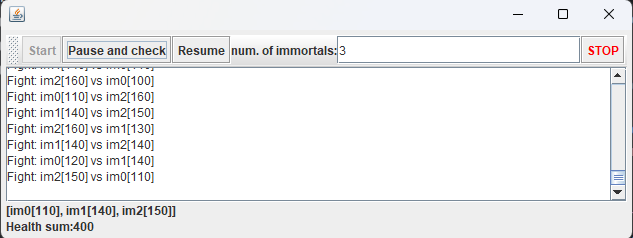
   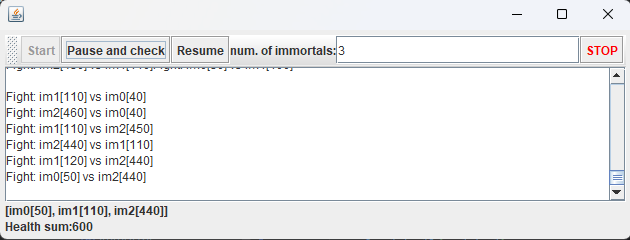
   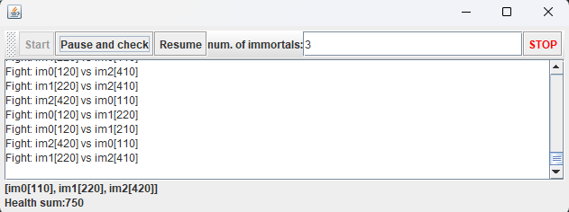

6. __Identifique posibles regiones críticas en lo que respecta a la pelea de los inmortales. Implemente una estrategia de bloqueo que evite las condiciones de carrera. Recuerde que si usted requiere usar dos o más ‘locks’ simultáneamente, puede usar bloques sincronizados anidados:__

	```java
	synchronized(locka){
		synchronized(lockb){
			…
		}
	}
	```
	Evidenciamos que la región crítica del programa se encuentra en el método fight, debido a que si dos immortals están peleando se deben bloquear para que otros immortals no los ataquen al tiempo, así que proponemos locks anidados entre los immortals que están peleando en un momento dado:  
	```java
 	public void fight(Immortal i2) {
        synchronized (this) {
            synchronized (i2) {
                if (i2.getHealth() > 0) {
                    i2.changeHealth(i2.getHealth() - defaultDamageValue);
                    this.health += defaultDamageValue;
                    updateCallback.processReport("Fight: " + this + " vs " + i2+"\n");
                } else {
                    updateCallback.processReport(this + " says:" + i2 + " is already dead!\n");
                }
            }
        }
    }
	```
7. __Tras implementar su estrategia, ponga a correr su programa, y ponga atención a si éste se llega a detener. Si es así, use los programas jps y jstack para identificar por qué el programa se detuvo.__  
	Al correr varias veces el programa, encontramos que se detiene varias veces en ocasiones distintas como las siguientes:  
	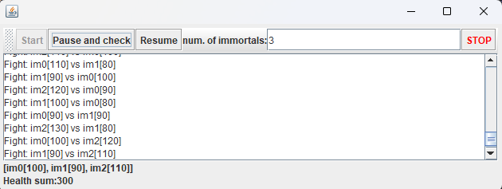
	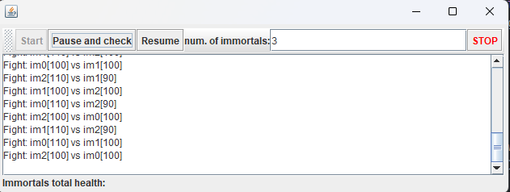
	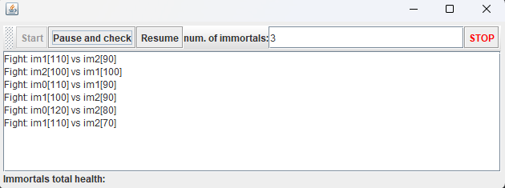  
  	Usando la herramiento de jps (Java Process Status Tool) podemos ver todo lo relacionado con los procesos, como listar los procesos en ejecución, en este caso el juego tiene id 30908:
	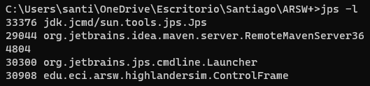  
	Después con jstack (Java Stack Trace) lo utilizamos para conocer la traza de pilas de los hilos que se están ejecutando en un proceso de Java específico, enviandole de parámetro el id obtenido anteriormente:  
	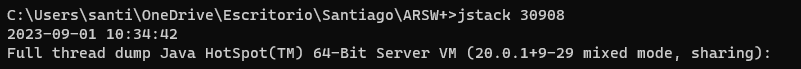
	Como conclusión la herramienta arroja que se encuentra un Deadlock:
	  
8. __Plantee una estrategia para corregir el problema antes identificado (puede revisar de nuevo las páginas 206 y 207 de _Java Concurrency in Practice_).__  
	Como solución planteamos un orden para adquirir los bloqueos por medio del identityHashCode, verificando que el que tenga menor Hash siempre sea el primero en bloquearse, evitando que se genere un deadlock.

9. __Una vez corregido el problema, rectifique que el programa siga funcionando de manera consistente cuando se ejecutan 100, 1000 o 10000 inmortales. Si en estos casos grandes se empieza a incumplir de nuevo el invariante, debe analizar lo realizado en el paso 4.__  
	Con 100 jugadores la suma debe dar siempre 10000:
	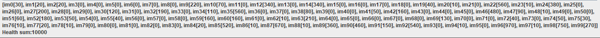
	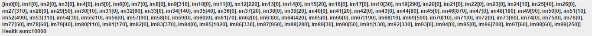
	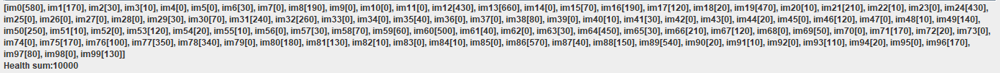
	Con 1000 jugadores la suma debe ser 100000:
	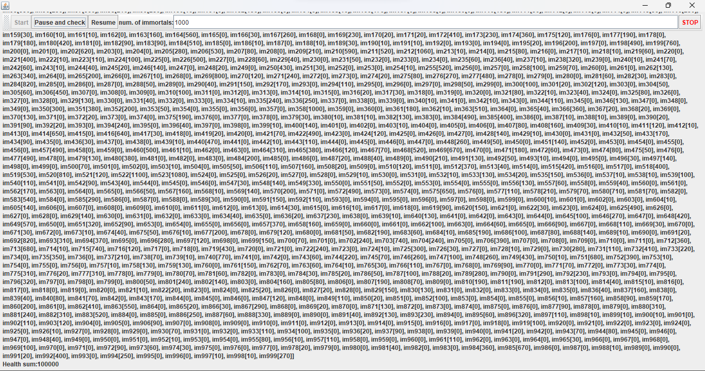
	Aquí el invariante no se está cumpliendo, viendo un error en la solución.
	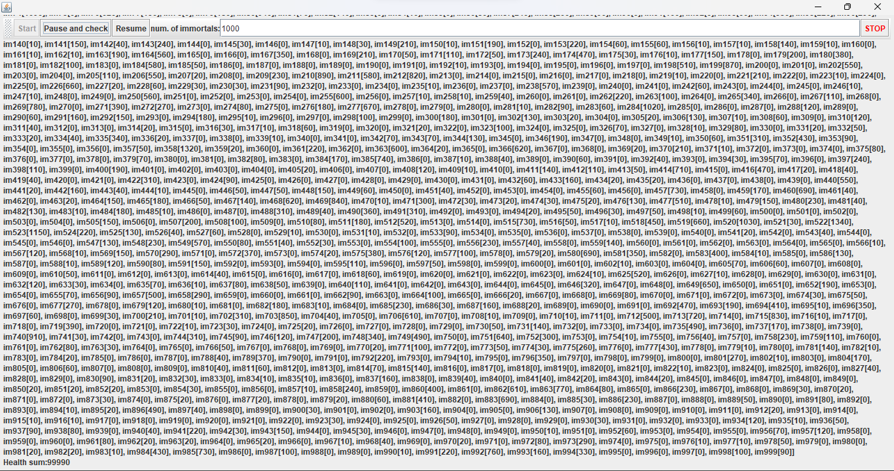
	Con 10000 jugadores la suma debe dar 1000000:  
	El computador no alcanzó a manejar tantos hilos.

10. __Un elemento molesto para la simulación es que en cierto punto de la misma hay pocos 'inmortales' vivos realizando peleas fallidas con 'inmortales' ya muertos. Es necesario ir suprimiendo los inmortales muertos de la simulación a medida que van muriendo. Para esto:__
	* __Analizando el esquema de funcionamiento de la simulación, esto podría crear una condición de carrera? Implemente la funcionalidad, ejecute la simulación y observe qué problema se presenta cuando hay muchos 'inmortales' en la misma. Escriba sus conclusiones al respecto en el archivo RESPUESTAS.txt.__  
    	La condición de carrera que evidenciamos es que en alguno que otro caso, muy aleatorio, con una gran cantidad de luchadores, se presenta un desfase en la invariante de más o menos 10, esto debido a que inmortales muertos seguían atacando.
	* __Corrija el problema anterior __SIN hacer uso de sincronización__, pues volver secuencial el acceso a la lista compartida de inmortales haría extremadamente lenta la simulación.__  
        Para solucionar el problema de los inmortales muertos, una vez el inmortal tenga una vida de 0 es eliminado del arreglo y de igual forma al momento de pelear verifica si el jugador que está atacando ya está muerto para evitar que logre pelear.

11. __Para finalizar, implemente la opción STOP.__  
	La implementación se encuentra en el código.

<!--
### Criterios de evaluación

1. Parte I.
	* Funcional: La simulación de producción/consumidor se ejecuta eficientemente (sin esperas activas).

2. Parte II. (Retomando el laboratorio 1)
	* Se modificó el ejercicio anterior para que los hilos llevaran conjuntamente (compartido) el número de ocurrencias encontradas, y se finalizaran y retornaran el valor en cuanto dicho número de ocurrencias fuera el esperado.
	* Se garantiza que no se den condiciones de carrera modificando el acceso concurrente al valor compartido (número de ocurrencias).


2. Parte III.
	* Diseño:
		- Coordinación de hilos:
			* Para pausar la pelea, se debe lograr que el hilo principal induzca a los otros a que se suspendan a sí mismos. Se debe también tener en cuenta que sólo se debe mostrar la sumatoria de los puntos de vida cuando se asegure que todos los hilos han sido suspendidos.
			* Si para lo anterior se recorre a todo el conjunto de hilos para ver su estado, se evalúa como R, por ser muy ineficiente.
			* Si para lo anterior los hilos manipulan un contador concurrentemente, pero lo hacen sin tener en cuenta que el incremento de un contador no es una operación atómica -es decir, que puede causar una condición de carrera- , se evalúa como R. En este caso se debería sincronizar el acceso, o usar tipos atómicos como AtomicInteger).

		- Consistencia ante la concurrencia
			* Para garantizar la consistencia en la pelea entre dos inmortales, se debe sincronizar el acceso a cualquier otra pelea que involucre a uno, al otro, o a los dos simultáneamente:
			* En los bloques anidados de sincronización requeridos para lo anterior, se debe garantizar que si los mismos locks son usados en dos peleas simultánemante, éstos será usados en el mismo orden para evitar deadlocks.
			* En caso de sincronizar el acceso a la pelea con un LOCK común, se evaluará como M, pues esto hace secuencial todas las peleas.
			* La lista de inmortales debe reducirse en la medida que éstos mueran, pero esta operación debe realizarse SIN sincronización, sino haciendo uso de una colección concurrente (no bloqueante).

	

	* Funcionalidad:
		* Se cumple con el invariante al usar la aplicación con 10, 100 o 1000 hilos.
		* La aplicación puede reanudar y finalizar(stop) su ejecución.
		
		-->

<a rel="license" href="http://creativecommons.org/licenses/by-nc/4.0/"></a><br />Este contenido hace parte del curso Arquitecturas de Software del programa de Ingeniería de Sistemas de la Escuela Colombiana de Ingeniería, y está licenciado como <a rel="license" href="http://creativecommons.org/licenses/by-nc/4.0/">Creative Commons Attribution-NonCommercial 4.0 International License</a>.
